# Ejercitacion Spotify

*`A tener en cuenta, no es necesario replicar todo al 100% en cuanto a medidas por eso es que en los requisitos principales no veran medidas. Agreguen el efecto hover donde sea necesario. Son libres de explorar y agregar lo que deseen, tanto efectos, como nuevas secciones o vistas. Las imagenes que se necesitan estan en la carpeta images de este repositorio, igualmente tienen libertad de elejir las suyas`*

FECHA DE ENTREGA: 20/09

## Ejercicios

- Agregar los efectos correspondientes a cada uno de los botones o links
- Las vistas debes ser responsives
- Agreguen el efecto hover cada vez que lo crean necesario
- Pueden utilizar todo lo que vimos en clase o investigar por su cuenta
- Css modularizado
- La estructura de carpetas deben ser los archivos html en la carpeta raiz y dentro `public` con las carpetas `css` y `images`
- La fuente utilizada es `Roboto Condensed` aunque pueden buscar otra, quisa, mas parecida.

### 1) Header

- El header debe estar fijo en la parte superior de la pantalla.
- El color de fondo del header debe ser #000000.
- La altura del header debe ser de 3.5rem en pantalla MOBILE, en desktop queda a criterio de cada una.
- Utilizar el icono `<i class="fa-solid fa-bars menu-profile"></i>` de font awesome para colocar este menu hamburguesa, el mismo debe desaparecer en pantallas mayores a 1024px y aparecer las opciones junto a nuestra imagen de perfil
- La imagen del logo se encuentra dentro de la carpeta `public/images`
- Al hacer click en el logo de spotify deberia enviarme al home o pagina principal

### 2) Home

SECTION SLOGAN

- El fondo debe ser del color `rgb(41, 65, 171)`
- La url de la imagen es `url("https://www-growth.scdn.co/static/home/bursts-mobile.svg")` y deben ubicarla lo mejor posible con background-position, y background-size
- La seccion del slogan/cartel de inicio debe ser 100vh o que cubra nuestra pantalla
- El color del texto del slogan y del boton debe ser #17ae4e.
- En 768px el titulo del slogan debe tener un tamaño de fuente de `6 rem`
- En 1024px el titulo del slogan debe tener un tamaño de fuente de `7 rem`

SECTION CARDS

- El titulo de esta seccion en el verde proporcionado(#17ae4e)
- Si observan bien, dentro de cada imagen se encuentra un logo de spotify que deben posicionar abajo a la derecha
- Hasta los 768 px solo se deben ver dos cards, de 768px hacia arriba se tienen que mostrar las 3 cards
- Las cards deben tener una sombra para dar un efecto de superpuesto.
- Esta seccion es creada por mi, son bastante libres de adaptarlo a sus gustos o pueden mejorarlo

### 3) Footer

- El footer debe acomodarse como lo vemos en las imagenes en cada uno de los tamaños de pantalla
- Los iconos para el footer son `<i class="fa-brands fa-instagram">`   |  `<i class="fa-brands fa-twitter"></i>`  |  `<i class="fa-brands fa-facebook-f"></i>`

### 4) Ayuda

- Debe tener el mismo header y el mismo footer que en el home
- Pueden utilizar lorem ipsum

Capturas: Estan Ordenadas de parte superior de la pagina a parte inferior, y de version mobile a desktop por cada parte

 

**Home: Primera Parte:**

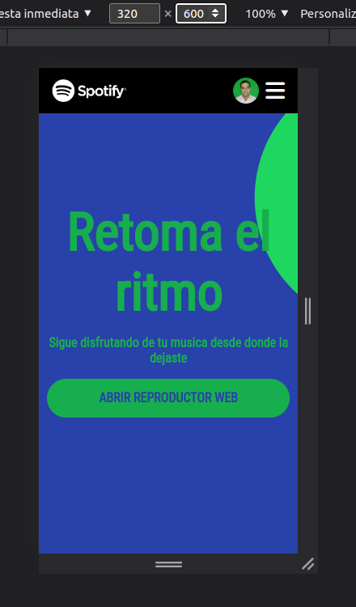
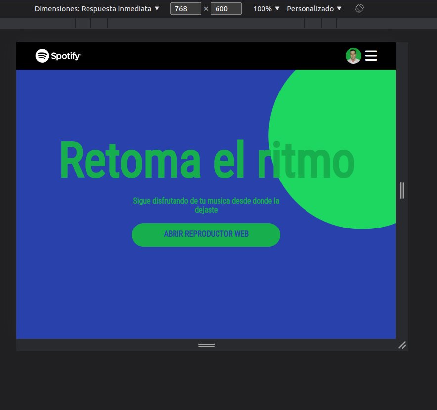
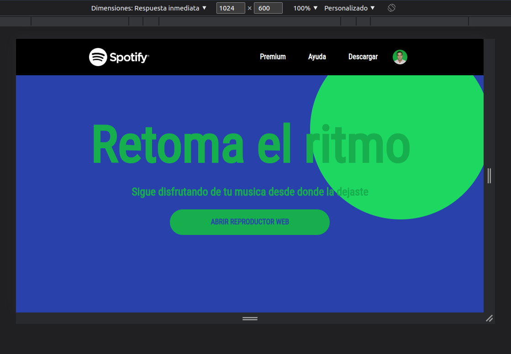
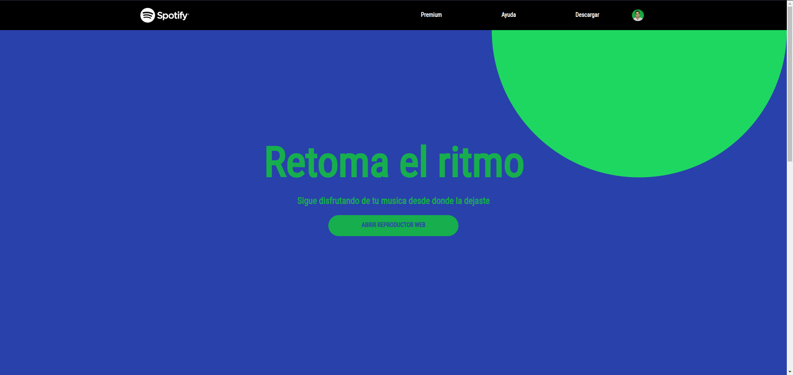

 
 
 
 
 
 
 

**Home: Segunda Parte:**

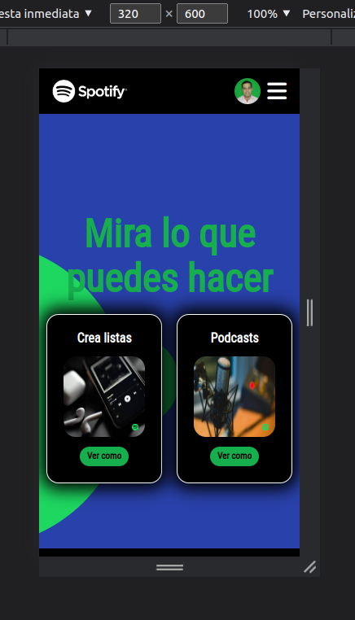
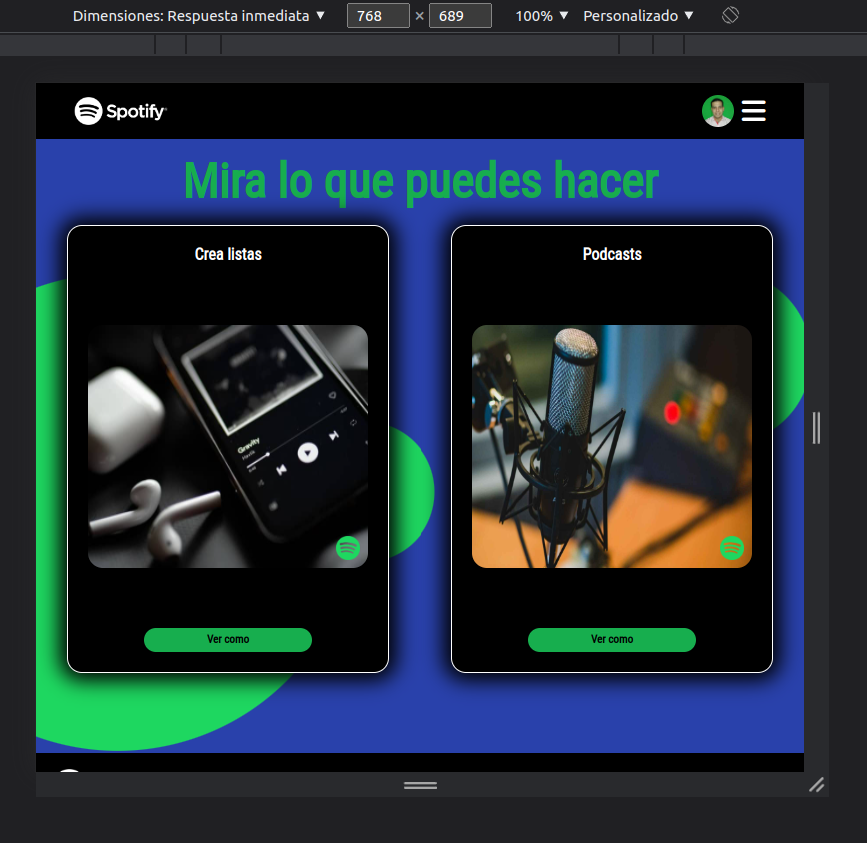
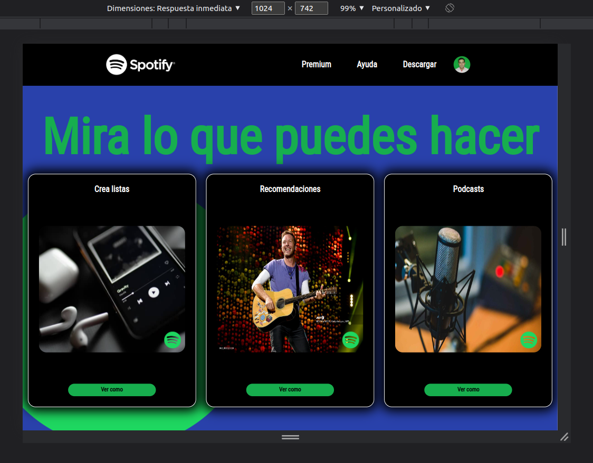
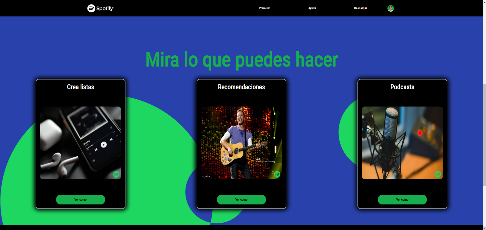

 
 
 
 
 
 
 

**Home: Tercera Parte:**

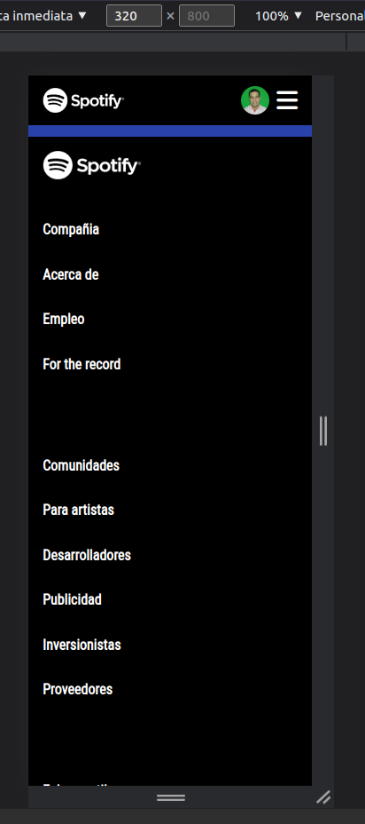
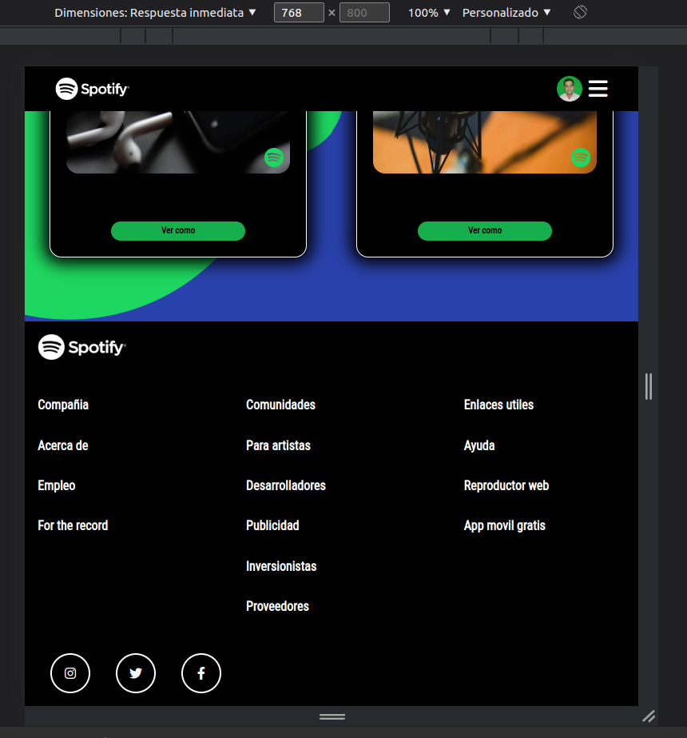
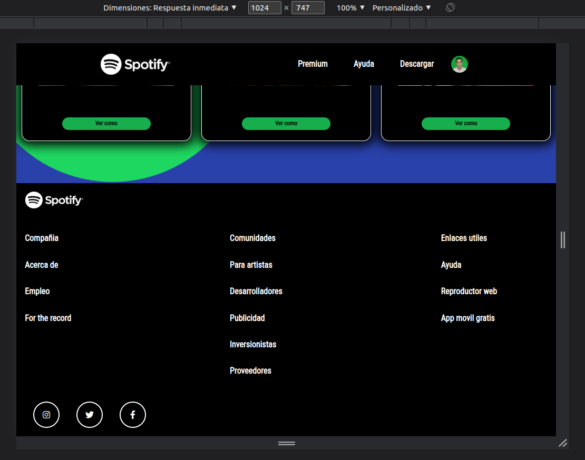
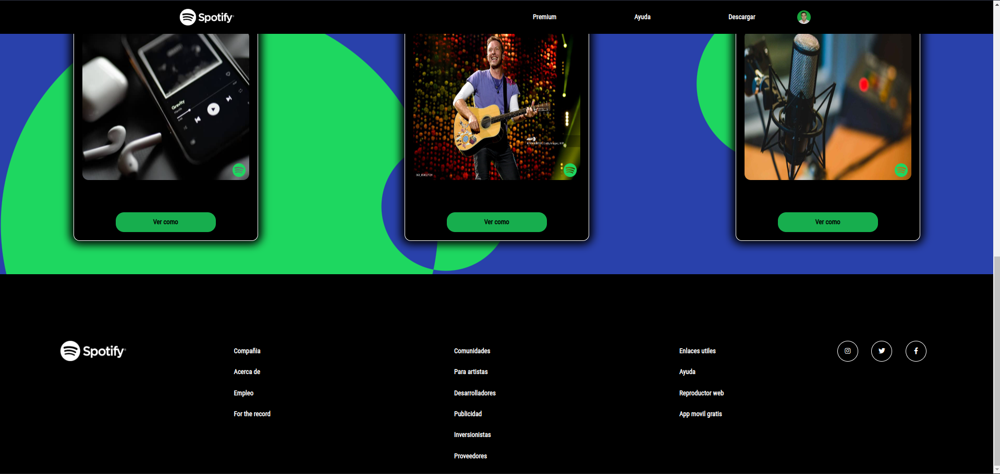

 
 
 
 
 
 
 

**Pagina Ayuda:**

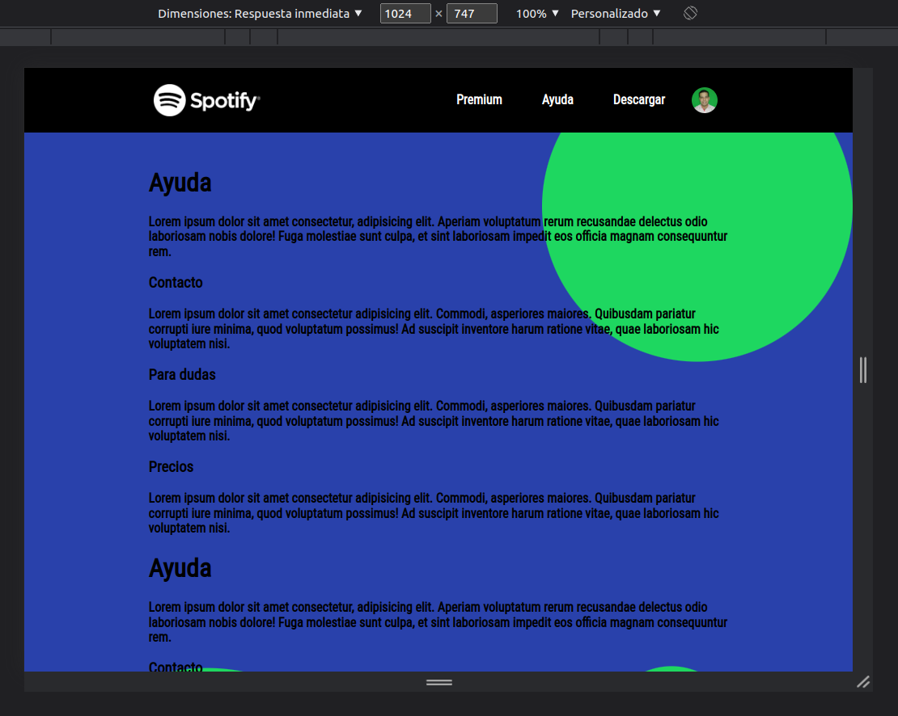
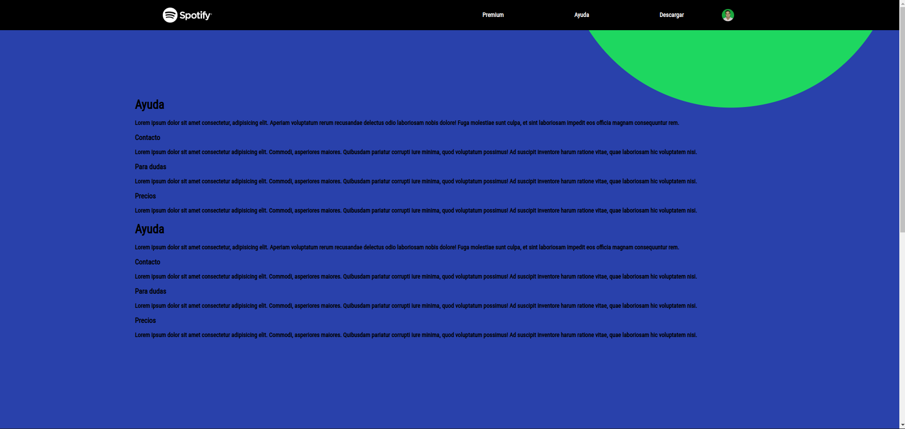